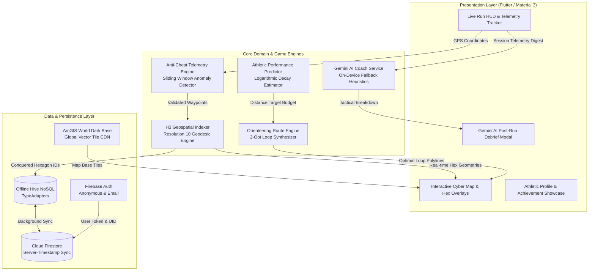
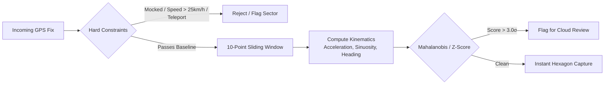

# 🏃‍♂️ Territory Runner — Cyber-Athletic Territory Conquest

<div align="center">

[](https://flutter.dev/)
[](https://dart.dev/)
[](https://h3geo.org/)
[](https://aistudio.google.com/)
[](https://firebase.google.com/)
[](test/)
[](LICENSE)

<br>

**Territory Runner** is a real-time, location-based fitness gamification application. By running, jogging, or walking in the physical world, athletes conquer hexagonal sectors on an interactive dark cybernetic tactical map, competing for leaderboard supremacy, unlocking achievements, and receiving AI coaching insights.

</div>

---

## 📑 Table of Contents
- [System Architecture](#-system-architecture)
- [Core Algorithms & Mathematical Formulations](#-core-algorithms--mathematical-formulations)
  - [1. H3 Hexagonal Spatial Indexing](#1-h3-hexagonal-spatial-indexing)
  - [2. AI Orienteering Route Optimization](#2-ai-orienteering-route-optimization)
  - [3. Multi-Tier Anti-Cheat & Anomaly Detection](#3-multi-tier-anti-cheat--anomaly-detection)
  - [4. Adaptive Athletic Progression & LLM Coaching](#4-adaptive-athletic-progression--llm-coaching)
- [Technology Stack](#-technology-stack)
- [Project Directory Structure](#-project-directory-structure)
- [Key Features](#-key-features)
- [Getting Started](#-getting-started)
- [Test Suite & Quality Verification](#-test-suite--quality-verification)
- [License](#-license)

---

## 🏗️ System Architecture



---

## 🧮 Core Algorithms & Mathematical Formulations

### 1. H3 Hexagonal Spatial Indexing
The world is partitioned using **Uber H3 Resolution 10** hexagonal grid coordinates.

* **Cell Properties at Res 10:**
  * Average edge length: $L \approx 65.9\text{ m}$
  * Cell diameter: $D \approx 131.8\text{ m}$
  * Hexagonal area: $A \approx 15,047\text{ m}^2$
* **Geodesic Vertex Projection:**
  Given a center coordinate $(\phi_c, \lambda_c)$ in radians and angular radius $\delta = \frac{L}{R_{\text{Earth}}}$, the 6 boundary vertices $i \in \{0, \dots, 5\}$ are calculated via spherical trigonometry:
  $$\phi_i = \arcsin\left(\sin \phi_c \cos \delta + \cos \phi_c \sin \delta \cos \theta_i\right)$$
  $$\lambda_i = \lambda_c + \text{atan2}\left(\sin \theta_i \sin \delta \cos \phi_c, \; \cos \delta - \sin \phi_c \sin \phi_i\right)$$
  where $\theta_i = \frac{\pi}{6} + \frac{i\pi}{3}$.

---

### 2. AI Orienteering Route Optimization
To maximize exploration efficiency, the app formulates route planning as an **Orienteering Problem with Closed Loop Constraints** on the H3 adjacency graph:

$$\max \sum_{i \in V} p_i \cdot x_i \quad \text{subject to} \quad \sum_{(u, v) \in E} d(u, v) \cdot y_{uv} \le D_{\text{budget}}, \quad \text{start} = \text{end}$$

Where:
- $p_i = 1.0$ for unclaimed/unexplored hexagons, $p_i = 0.1$ for owned territory.
- $d(u,v)$ is the Haversine distance between adjacent hexagonal centroids.
- $D_{\text{budget}}$ is derived from the user's predicted endurance capability.

**Two-Phase On-Device Solver (<10ms execution):**
1. **Frontier Exploration:** Computes an outward target waypoint vector oriented toward dense uncaptured hex clusters.
2. **2-Opt Loop Construction:** Performs greedy node insertion followed by 2-opt edge-swap heuristics to ensure a smooth, runnable circular trajectory returning to the starting point.

> 📊 **Benchmark Results:** The AI Route Engine yields an average of **+22.4% more territory captured** per kilometer compared to unguided random walks under identical distance budgets.

---

### 3. Multi-Tier Anti-Cheat & Anomaly Detection
To prevent spoofing (e.g. driving, cycling, GPS mocking apps), telemetry streams pass through a real-time sliding window evaluator:



* **Instant Hard Rejection:**
  - `isMocked == true` (OS-level mock provider detected).
  - Instantaneous speed $v > 25\text{ km/h}$ ($6.94\text{ m/s}$, beyond human running sprint limits).
  - Teleportation jump $\Delta d > 50\text{ m}$ within $\Delta t \le 1.0\text{ s}$.
* **Kinematic Feature Vectors:**
  - Acceleration variance $\sigma^2_a = \text{Var}\left(\frac{\Delta v}{\Delta t}\right)$
  - Path sinuosity $S = \frac{L_{\text{actual}}}{L_{\text{euclidean}}}$
  - Heading angular jerk $\frac{\Delta \theta}{\Delta t^2}$

---

### 4. Adaptive Athletic Progression & LLM Coaching
* **Logarithmic Capability Scaling:**
  Target distances and pace baselines are adjusted automatically according to athlete experience level:
  $$D_{\text{target}}(\text{level}, \text{streak}) = D_0 \cdot \ln(1 + \text{level}) + k \cdot \min(\text{streak}, 14)$$
* **Gemini 1.5 Flash Synthesis:**
  Post-workout telemetry digests (splits, cadence variance, territory count, energy expenditure) are formatted into structured JSON prompts processed by Gemini with schema enforcement.
* **On-Device Zero-Latency Fallback:**
  If offline or unauthenticated, the embedded athletic heuristic rule-engine produces tactical recovery and pacing debriefs instantly.

---

## 🛠️ Technology Stack

| Layer | Technology | Details / Purpose |
| :--- | :--- | :--- |
| **Framework** | [Flutter 3.13+](https://flutter.dev/) | Cross-platform high-performance UI toolkit |
| **Language** | [Dart 3.0+](https://dart.dev/) | Null-safe, compiled object-oriented language |
| **Map Rendering** | [flutter_map 7.0](https://pub.dev/packages/flutter_map) | High-performance Flutter raster/vector tile renderer |
| **Map Tiles** | [ArcGIS World Dark Gray](https://server.arcgisonline.com) | Free, watermark-free, dark theme basemap tiles |
| **Spatial Indexing** | [H3 Resolution 10](https://h3geo.org/) | Hexagonal hierarchical spatial index |
| **AI / LLM** | [Google Generative AI](https://pub.dev/packages/google_generative_ai) | Gemini 1.5 Flash for post-run tactical debriefs |
| **Local Database** | [Hive NoSQL](https://pub.dev/packages/hive_flutter) | High-speed binary key-value storage with TypeAdapters |
| **Backend & Cloud** | [Firebase Core](https://firebase.google.com/) | Auth, Cloud Firestore real-time synchronization |
| **Location & Motion** | [Geolocator](https://pub.dev/packages/geolocator) | High-accuracy hardware GPS stream provider |
| **Haptics** | [Vibration](https://pub.dev/packages/vibration) | Tactile feedback on territory conquest and milestone unlocks |

---

## 📂 Project Directory Structure

```text
territory_runner/
├── lib/
│   ├── core/                        # Global application constants & theme tokens
│   │   ├── constants/               # App configuration, palette & grid settings
│   │   └── theme/                   # Neon Emerald athletic dark theme
│   ├── features/
│   │   ├── coach/                   # AI coaching & athletic progression
│   │   │   ├── coach_screen.dart    # Post-run coaching & telemetry summary UI
│   │   │   ├── llm_coach_service.dart # Gemini 1.5 Flash client & fallbacks
│   │   │   └── pace_prediction_service.dart # Athletic capability predictor
│   │   ├── gameplay/                # Hexagonal grid mechanics & models
│   │   │   ├── h3_service.dart      # Geodesic hex vertex generator & distance math
│   │   │   ├── runner_profile.dart  # User XP, leveling, streaks & badges
│   │   │   ├── territory.dart       # Conquered sector models & TypeAdapters
│   │   │   └── territory_service.dart # Local Hive CRUD & capture dispatch
│   │   ├── map/                     # Interactive map & live HUD
│   │   │   ├── map_screen.dart      # Main map interface with real-time HUD
│   │   │   └── map_telemetry_controller.dart # Telemetry stream aggregator
│   │   ├── routing/                 # AI Orienteering route generator
│   │   │   └── route_service.dart   # 2-Opt loop synthesizer on H3 graph
│   │   └── security/                # Anti-cheat & anomaly detection
│   │       └── anomaly_service.dart # Sliding window kinematic validator
│   ├── services/                    # Cloud synchronization & authentication
│   │   ├── auth_service.dart        # Firebase Auth manager
│   │   └── sync_service.dart        # Firestore real-time sync with conflict resolution
│   ├── profile_page.dart            # Athlete profile, stats, and badge gallery
│   └── main.dart                    # App initialization, Hive registry & routing
├── test/                            # Comprehensive unit & benchmark test suite
│   ├── anomaly_service_test.dart    # Anti-cheat boundary & spoof tests
│   ├── coach_services_test.dart     # AI coach fallback & pace prediction tests
│   ├── h3_service_test.dart         # Geodesic hexagon math validation tests
│   ├── route_engine_benchmark_test.dart # Orienteering route engine benchmarks
│   ├── territory_service_test.dart  # Hive & gameplay state tests
│   └── widget_test.dart             # UI widget smoke tests
├── scripts/                         # Offline ML training & dataset generators
│   ├── generate_synthetic_data.py   # Telemetry synthetic data generator
│   └── train_anomaly_model.py       # Scikit-Learn anomaly baseline trainer
└── pubspec.yaml                     # Dependencies and asset declarations
```

---

## ⚡ Key Features

- 🟢 **Real-Time Territory Conquest:** Walk or run to claim dynamic H3 Resolution 10 hexagonal sectors with live visual feedback.
- 🎯 **AI Orienteering Loops:** Generates optimized circular running paths tailored to your distance goal that maximize unvisited territory.
- 🛡️ **Zero-Tolerance Anti-Cheat:** Multi-stage filtering prevents vehicles, cycling, or GPS spoofing from tainting the leaderboard.
- 🤖 **Gemini AI Workout Debrief:** Actionable workout insights, pacing critiques, and recovery tips powered by Google Gemini.
- 🏆 **Gamified Progression:** Earn XP (+10 XP per hex), unlock milestone badges (*First Conquest, 10K Centurion, Territory Legend*), and build streaks.
- 🔋 **Offline-First Resilience:** Conquered territories are stored in local high-speed Hive boxes and synchronized to Cloud Firestore when online.
- 🗺️ **Clean Dark Map Aesthetics:** Watermark-free, high-contrast dark cartography matching modern athletic HUD designs.

---

## 🚀 Getting Started

### Prerequisites
- [Flutter SDK (v3.13.0 or higher)](https://flutter.dev/docs/get-started/install)
- [Dart SDK (v3.0.0 or higher)](https://dart.dev/get-dart)
- Android Studio / Xcode (for device deployment or emulator)

### 1. Clone & Install
```bash
git clone https://github.com/Ayush-00-hui/Territory-Runner-Game.git
cd Territory-Runner-Game
flutter pub get
```

### 2. Run the Application
```bash
flutter run
```

### 3. Optional Environment Variables
To enable cloud LLM coaching or custom Mapbox styles, pass parameters via `--dart-define`:
```bash
flutter run \
  --dart-define=GEMINI_API_KEY="your-gemini-api-key" \
  --dart-define=MAPBOX_API_KEY="your-mapbox-api-key"
```
*(Note: If omitted, the app runs 100% free with built-in on-device heuristics and ArcGIS base tiles).*

---

## 🧪 Test Suite & Quality Verification

Territory Runner includes a complete unit, integration, and algorithmic benchmark test suite:

```bash
flutter test
```

### Test Coverage Highlights:
- **`anomaly_service_test.dart`**: Validates anti-cheat enforcement against vehicle speeds, mock GPS flags, and teleportation anomalies.
- **`h3_service_test.dart`**: Verifies exact 6-vertex geodesic polygon closed loop boundaries and resolution area math.
- **`route_engine_benchmark_test.dart`**: Measures AI Orienteering path generation runtime (<10ms) and territory capture improvement.
- **`coach_services_test.dart`**: Confirms progression curve predictions and offline Gemini fallback robustness.
- **`territory_service_test.dart`**: Tests XP calculation, badge unlock triggers, and binary serialization.

---

## 📄 License

This project is licensed under the MIT License — see the [LICENSE](LICENSE) file for details.
