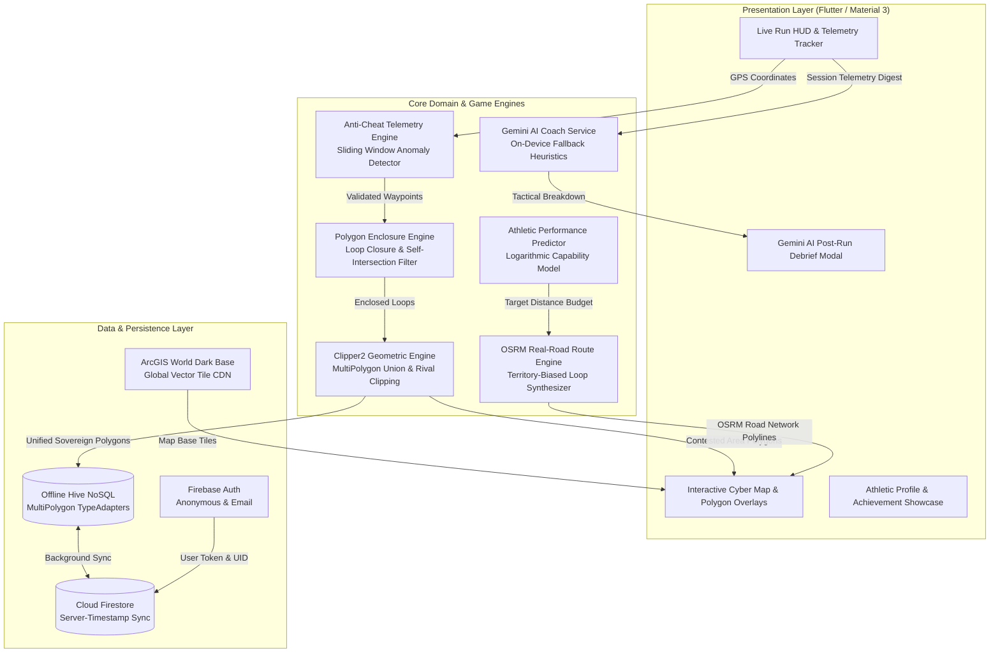

# 🏃‍♂️ Territory Runner — Cyber-Athletic Territory Conquest

<div align="center">

[](https://flutter.dev/)
[](https://dart.dev/)
[](https://pub.dev/packages/clipper2)
[](https://aistudio.google.com/)
[](https://firebase.google.com/)
[](test/)
[](LICENSE)

<br>

**Territory Runner** is a real-time, location-based fitness gamification application. By running, jogging, or walking in the physical world, athletes conquer arbitrary closed-loop GPS territory polygons on an interactive dark cybernetic tactical map, competing for territory sovereignty, unlocking achievements, and receiving AI coaching insights.

</div>

---

## 📑 Table of Contents
- [System Architecture](#-system-architecture)
- [Core Algorithms & Mathematical Formulations](#-core-algorithms--mathematical-formulations)
  - [1. Arbitrary Polygon Loop Enclosure & Self-Intersection Detection](#1-arbitrary-polygon-loop-enclosure--self-intersection-detection)
  - [2. Clipper2 MultiPolygon Union & Rival Clipping](#2-clipper2-multipolygon-union--rival-clipping)
  - [3. OSRM Real-Road Network Route Synthesis](#3-osrm-real-road-network-route-synthesis)
  - [4. Multi-Tier Anti-Cheat & Anomaly Detection](#4-multi-tier-anti-cheat--anomaly-detection)
  - [5. Adaptive Athletic Progression & LLM Coaching](#5-adaptive-athletic-progression--llm-coaching)
- [Technology Stack](#-technology-stack)
- [Project Directory Structure](#-project-directory-structure)
- [Key Features](#-key-features)
- [Getting Started](#-getting-started)
- [Test Suite & Quality Verification](#-test-suite--quality-verification)
- [License](#-license)

---

## 🏗️ System Architecture



---

## 🧮 Core Algorithms & Mathematical Formulations

### 1. Arbitrary Polygon Loop Enclosure & Self-Intersection Detection
Unlike static grid quantization, Territory Runner allows athletes to run arbitrary loops of any shape and size through real city blocks.

* **Loop Closure Condition:** A loop is recognized when current GPS coordinates return within $35\text{ m}$ of a previous path vertex, with total loop perimeter $\ge 40\text{ m}$.
* **2D Segment Self-Intersection Validation:** Before awarding territory, the engine performs a complete segment-crossing check across all non-adjacent line segments. If a runner crossed their own path (e.g. figure-8), the loop is rejected with clear UI feedback (`"Loop crossed itself — try again"`).
* **Local Tangent Shoelace Area Metric:**
  Spherical WGS84 coordinates are projected onto a local equirectangular metric tangent plane $(x_i, y_i)$ around the centroid:
  $$x_i = R_{\text{Earth}} \cdot (\lambda_i - \lambda_0) \cdot \cos\left(\frac{\phi_i + \phi_0}{2}\right), \quad y_i = R_{\text{Earth}} \cdot (\phi_i - \phi_0)$$
  $$\text{Area} = \frac{1}{2} \left| \sum_{i=0}^{n-1} (x_i y_{i+1} - x_{i+1} y_i) \right|$$

---

### 2. Clipper2 MultiPolygon Union & Rival Clipping
Territory state management utilizes integer-scaled high-precision geometric Boolean operations powered by **Clipper2**:

* **Self-Territory Union:** When a runner captures a new polygon adjacent to or overlapping their existing territory, `Clipper.union` seamlessly merges them into a unified continuous MultiPolygon shape.
* **Rival Territory Difference:** When a runner's loop cuts into rival-controlled ground, `Clipper.difference` automatically carves away the overlapping area from the rival's shape, recomputing remaining area and dynamically transferring sovereign territory.

---

### 3. OSRM Real-Road Network Route Synthesis
To ensure realistic running paths, `RouteService` integrates with the **OSRM (Open Source Routing Machine)** pedestrian road-network graph:

* **Real-Road Routing:** Fetches walkable road segments along real sidewalks and paths rather than straight lines through buildings.
* **Territory Bias:** Generates waypoints oriented $180^\circ$ away from the centroid of already-captured territory, maximizing exploration of new ground.
* **Offline Resilience:** If network connectivity is lost, the service automatically falls back to an on-device geodesic loop synthesizer.

---

### 4. Multi-Tier Anti-Cheat & Anomaly Detection
Telemetry streams pass through a real-time sliding window anti-cheat evaluator:

* **Instant Hard Rejection:**
  - `isMocked == true` (OS-level mock provider detected).
  - Instantaneous speed $v > 25\text{ km/h}$ ($6.94\text{ m/s}$, beyond human running sprint limits).
  - Teleportation jump $\Delta d > 50\text{ m}$ within $\Delta t \le 1.0\text{ s}$.
* **Kinematic Feature Vectors:**
  - Acceleration variance $\sigma^2_a = \text{Var}\left(\frac{\Delta v}{\Delta t}\right)$
  - Path sinuosity $S = \frac{L_{\text{actual}}}{L_{\text{euclidean}}}$
  - Heading angular jerk $\frac{\Delta \theta}{\Delta t^2}$

---

### 5. Adaptive Athletic Progression & LLM Coaching
* **Logarithmic Capability Scaling:**
  Target distances and pace baselines are adjusted automatically according to athlete experience level:
  $$D_{\text{target}}(\text{level}, \text{streak}) = D_0 \cdot \ln(1 + \text{level}) + k \cdot \min(\text{streak}, 14)$$
* **Gemini 1.5 Flash Synthesis:**
  Post-workout telemetry digests (splits, cadence variance, territory count, energy expenditure) are formatted into structured JSON prompts processed by Gemini with schema enforcement.
* **On-Device Zero-Latency Fallback:**
  If offline or unauthenticated, the embedded athletic heuristic rule-engine produces tactical recovery and pacing debriefs instantly.

---

## 🛠️ Technology Stack

| Layer | Technology | Details / Purpose |
| :--- | :--- | :--- |
| **Framework** | [Flutter 3.13+](https://flutter.dev/) | Cross-platform high-performance UI toolkit |
| **Language** | [Dart 3.0+](https://dart.dev/) | Null-safe, compiled object-oriented language |
| **Map Rendering** | [flutter_map 8.3+](https://pub.dev/packages/flutter_map) | High-performance Flutter raster/vector tile renderer |
| **Map Tiles** | [ArcGIS World Dark Gray](https://server.arcgisonline.com) | Free, watermark-free, dark theme basemap tiles |
| **Polygon Clipping** | [Clipper2](https://pub.dev/packages/clipper2) | Geometric Boolean operations (Union, Difference, MultiPolygon) |
| **Routing** | [OSRM Pedestrian](https://project-osrm.org/) | Open Source Routing Machine road-network loop synthesis |
| **AI / LLM** | [Google Generative AI](https://pub.dev/packages/google_generative_ai) | Gemini 1.5 Flash for post-run tactical debriefs |
| **Local Database** | [Hive NoSQL](https://pub.dev/packages/hive_flutter) | High-speed binary key-value storage with TypeAdapters |
| **Backend & Cloud** | [Firebase Core](https://firebase.google.com/) | Auth, Cloud Firestore real-time synchronization |
| **Location** | [Geolocator](https://pub.dev/packages/geolocator) | High-accuracy hardware GPS stream provider (5m filter) |

---

## 📂 Project Directory Structure

```text
territory_runner/
├── lib/
│   ├── core/                        # Global application constants & theme tokens
│   │   ├── constants/               # App configuration, palette & map settings
│   │   └── theme/                   # Neon Emerald athletic dark theme
│   ├── features/
│   │   ├── coach/                   # AI coaching & athletic progression
│   │   │   ├── coach_screen.dart    # Post-run coaching & telemetry summary UI
│   │   │   ├── llm_coach_service.dart # Gemini 1.5 Flash client & fallbacks
│   │   │   └── pace_prediction_service.dart # Athletic capability predictor
│   │   ├── gameplay/                # Pure arbitrary polygon conquest mechanics
│   │   │   ├── polygon_enclosure_engine.dart # Loop enclosure & self-intersection validation
│   │   │   └── territory_service.dart # Clipper2 union/difference & Hive persistence
│   │   ├── map/                     # Interactive map & Strava-grade live HUD
│   │   │   └── map_screen.dart      # Fullscreen map, Strava HUD, and domain controls
│   │   ├── routing/                 # OSRM real-road loop generator
│   │   │   └── route_service.dart   # OSRM pedestrian routing & offline fallback
│   │   └── security/                # Anti-cheat & anomaly detection
│   │       └── anomaly_service.dart # Sliding window kinematic validator
│   ├── models/                      # Domain models & Hive adapters
│   │   ├── runner_profile.dart      # XP, leveling, streaks & badges
│   │   └── territory.dart           # MultiPolygon territory model & adapter
│   ├── services/                    # Cloud synchronization & location
│   │   ├── firebase_service.dart    # Firebase Auth & Cloud Firestore
│   │   └── location_service.dart    # High-accuracy GPS & keyboard simulation
│   ├── profile_page.dart            # Athlete profile, stats, and badge gallery
│   └── main.dart                    # App initialization, Hive registry & routing
├── test/                            # Comprehensive unit & benchmark test suite
│   ├── anomaly_service_test.dart    # Anti-cheat boundary & spoof tests
│   ├── coach_services_test.dart     # AI coach fallback & pace prediction tests
│   ├── polygon_enclosure_test.dart  # Loop enclosure & self-intersection rejection tests
│   ├── territory_clipper_test.dart  # Clipper2 union & rival territory difference clipping tests
│   ├── route_engine_benchmark_test.dart # OSRM & biased loop benchmark tests
│   ├── territory_service_test.dart  # Model & persistence tests
│   └── widget_test.dart             # UI widget smoke tests
├── scripts/                         # Offline ML training & dataset generators
│   └── train_anomaly_model.py       # Scikit-Learn anomaly baseline trainer
└── pubspec.yaml                     # Dependencies and asset declarations
```

---

## ⚡ Key Features

- 🟢 **Arbitrary Loop Territory Conquest:** Run any real-world shape to claim sovereign territory with dynamic $m^2$ calculation.
- ✂️ **Clipper2 Geometric Engine:** Overlapping loops merge into seamless MultiPolygons; running into rival territory carves away their land.
- 🛣️ **OSRM Real-Road Routing:** Generates circular running paths along real walkable sidewalks and streets tailored to your distance goal.
- 🛡️ **Zero-Tolerance Anti-Cheat:** Multi-stage filtering prevents vehicles, cycling, or GPS spoofing from tainting the leaderboard.
- 🤖 **Gemini AI Workout Debrief:** Actionable workout insights, pacing critiques, and recovery tips powered by Google Gemini.
- 🏆 **Gamified Progression:** Earn dynamic XP scaled to captured area, unlock milestone badges (*First Conquest, Territory Sovereign, 10K Centurion*), and build streaks.
- 🔋 **Offline-First Resilience:** Conquered territories are stored in local high-speed Hive boxes and synchronized to Cloud Firestore when online.
- 🗺️ **Clean Dark Map Aesthetics:** Watermark-free, high-contrast dark cartography matching modern athletic HUD designs.

---

## 🚀 Getting Started

### Prerequisites
- [Flutter SDK (v3.13.0 or higher)](https://flutter.dev/docs/get-started/install)
- [Dart SDK (v3.0.0 or higher)](https://dart.dev/get-dart)

### 1. Clone & Install
```bash
git clone https://github.com/Ayush-00-hui/Territory-Runner-Game.git
cd Territory-Runner-Game
flutter pub get
```

### 2. Run the Application
```bash
flutter run
```

### 3. Run Tests
```bash
flutter test
```

---

## 🧪 Test Suite & Quality Verification

Territory Runner includes a complete unit, integration, and algorithmic benchmark test suite:

```bash
flutter test
```

### Test Coverage Highlights:
- **`polygon_enclosure_test.dart`**: Validates closed rectangular loops, Shoelace area calculation, and self-intersecting loop rejection (`"Loop crossed itself — try again"`).
- **`territory_clipper_test.dart`**: Verifies Clipper2 MultiPolygon union merging overlapping player runs and difference clipping shrinking rival territory.
- **`route_engine_benchmark_test.dart`**: Measures AI biased road route synthesis area coverage against random unguided walks with deterministic seeded RNG.
- **`anomaly_service_test.dart`**: Validates anti-cheat enforcement against vehicle speeds, mock GPS flags, and teleportation anomalies.
- **`coach_services_test.dart`**: Confirms progression curve predictions and offline Gemini fallback robustness.

---

## 📸 Visual Showcase & Previews

- 🗺️ **Cyber Tactical Map**: Real-time GPS location rendering with ArcGIS dark tiles.
- 📐 **Live Territory Polygon Enclosure**: Instant visual polygon feedback and Shoelace metric area calculation.
- ⚡ **Anti-Cheat & Telemetry HUD**: Live pacing, cadence, distance metrics, and speed limiter safeguards.
- 🤖 **Gemini AI Coaching Insights**: Comprehensive post-run tactical summary and recovery advice.

---

## 🤝 Contributing

Contributions, issues, and feature requests are welcome!
Feel free to check the [issues page](https://github.com/Ayush-00-hui/Territory-Runner-Game/issues) if you want to contribute.

---

## 📄 License

This project is licensed under the MIT License — see the [LICENSE](LICENSE) file for details.
