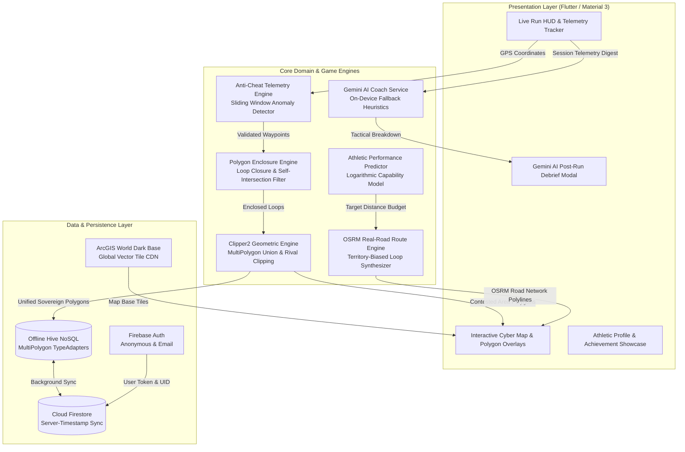
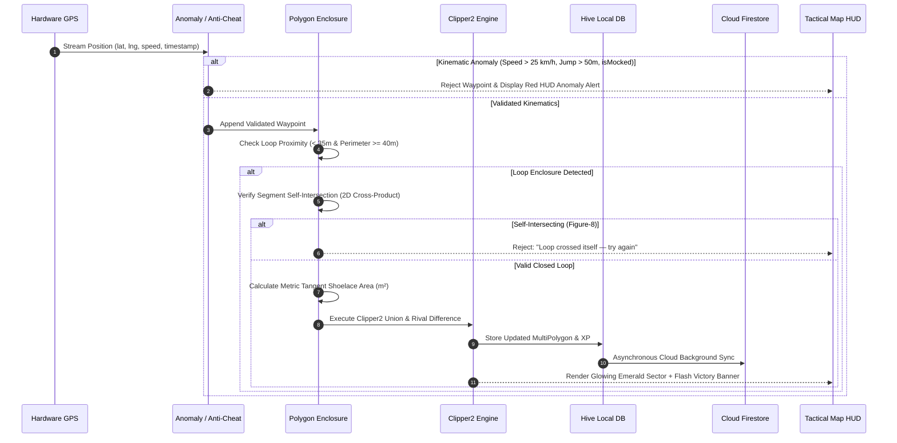
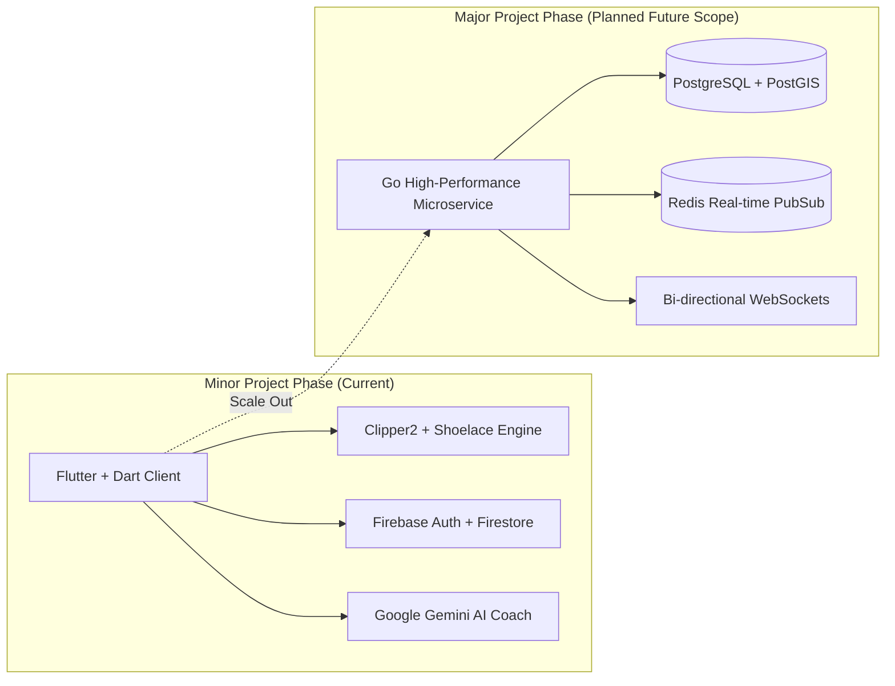

# 🏃‍♂️ Territory Runner — Cyber-Athletic Territory Conquest

<div align="center">

[](https://flutter.dev/)
[](https://dart.dev/)
[](https://pub.dev/packages/clipper2)
[](https://aistudio.google.com/)
[](https://firebase.google.com/)
[](https://project-osrm.org/)
[](test/)
[](LICENSE)

<br>

**Territory Runner** is a high-performance, real-time location-based fitness gamification application. By running, jogging, or walking in the physical world, athletes conquer arbitrary closed-loop GPS territory polygons on an interactive dark cybernetic tactical map, competing for territory sovereignty, unlocking milestone achievements, and receiving AI coaching insights.

[✨ Key Features](#-key-features) • [🏗️ Architecture](#%EF%B8%8F-system-architecture) • [🧮 Algorithms](#-core-algorithms--mathematical-formulations) • [🎮 Viva Demo Lab](#-classroom--viva-demonstration-lab) • [🚀 Quick Start](#-getting-started)

</div>

---

## 📑 Table of Contents
- [Executive Overview](#-executive-overview)
- [System Architecture](#%EF%B8%8F-system-architecture)
- [Real-Time Game Loop & Conquest State Machine](#-real-time-game-loop--conquest-state-machine)
- [Core Algorithms & Mathematical Formulations](#-core-algorithms--mathematical-formulations)
  - [1. Arbitrary Polygon Loop Enclosure & Self-Intersection Filter](#1-arbitrary-polygon-loop-enclosure--self-intersection-filter)
  - [2. Clipper2 MultiPolygon Union & Rival Clipping](#2-clipper2-multipolygon-union--rival-clipping)
  - [3. OSRM Real-Road Network Route Synthesis](#3-osrm-real-road-network-route-synthesis)
  - [4. Multi-Tier Anti-Cheat & Kinematic Anomaly Detection](#4-multi-tier-anti-cheat--kinematic-anomaly-detection)
  - [5. Adaptive Athletic Progression & LLM Coaching](#5-adaptive-athletic-progression--llm-coaching)
- [Technology Stack](#%EF%B8%8F-technology-stack)
- [Project Directory Structure](#-project-directory-structure)
- [Key Features & Tactical UI](#-key-features)
- [Classroom & Viva Demonstration Lab](#-classroom--viva-demonstration-lab)
- [Roadmap & Scalability Evolution](#%EF%B8%8F-roadmap--major-project-evolution)
- [Getting Started & Configuration](#-getting-started)
- [Test Suite & Algorithmic Benchmarks](#-test-suite--quality-verification)
- [Contributing & License](#-contributing)

---

## 🌟 Executive Overview

Traditional fitness trackers record passive linear polylines. **Territory Runner** turns the entire physical world into a dynamic, competitive strategy arena:

```
🏃 Athlete Runs Closed Loop ──► 🛰️ Telemetry Validation ──► 📐 Shoelace Area Metric
                                                                     │
🏆 Leaderboard & Sovereign XP ◄── ☁️ Cloud Sync ◄── ✂️ Clipper2 Boolean Geometry
```

- 🟢 **No Rigid Grids:** Claim arbitrary organic loop polygons around city blocks, parks, or tracks.
- ✂️ **Real-Time Territory Battles:** Overlapping loops merge automatically via **Clipper2 Boolean Union**; slicing into enemy sectors carves away rival ground via **Boolean Difference**.
- 🛡️ **Zero-Tolerance Anti-Cheat:** Multi-layer kinematics filters out vehicles, spoofed location packets, and teleportation glitches.
- 🤖 **Next-Gen AI Coach:** Generates structured post-run tactical debriefs and pacing recovery tips with **Google Gemini 1.5 Flash**.

---

## 🏗️ System Architecture


```mermaid
graph TD
    subgraph UI ["Presentation Layer (Flutter / Material 3)"]
        HUD[Live Run HUD & Telemetry Tracker]
        MapUI[Interactive Cyber Map & Polygon Overlays]
        ProfileUI[Athletic Profile & Achievement Showcase]
        CoachModal[Gemini AI Post-Run Debrief Modal]
    end

    subgraph Core ["Core Domain & Game Engines"]
        PolygonEngine[Polygon Enclosure Engine<br/>Loop Closure & Self-Intersection Filter]
        ClipperEngine[Clipper2 Geometric Engine<br/>MultiPolygon Union & Rival Clipping]
        RouteEngine[OSRM Real-Road Route Engine<br/>Territory-Biased Loop Synthesizer]
        SecurityEngine[Anti-Cheat Telemetry Engine<br/>Sliding Window Anomaly Detector]
        PaceEngine[Athletic Performance Predictor<br/>Logarithmic Capability Model]
        LLMCoach[Gemini AI Coach Service<br/>On-Device Fallback Heuristics]
    end

    subgraph Storage ["Data & Persistence Layer"]
        HiveDB[(Offline Hive NoSQL<br/>MultiPolygon TypeAdapters)]
        Firestore[(Cloud Firestore<br/>Server-Timestamp Sync)]
        FirebaseAuth[Firebase Auth<br/>Anonymous & Email]
        TileServer[ArcGIS World Dark Base<br/>Global Vector Tile CDN]
    end

    HUD -->|GPS Coordinates| SecurityEngine
    SecurityEngine -->|Validated Waypoints| PolygonEngine
    PolygonEngine -->|Enclosed Loops| ClipperEngine
    ClipperEngine -->|Unified Sovereign Polygons| HiveDB
    ClipperEngine -->|Contested Area Polygons| MapUI
    RouteEngine -->|OSRM Road Network Polylines| MapUI
    PaceEngine -->|Target Distance Budget| RouteEngine
    HUD -->|Session Telemetry Digest| LLMCoach
    LLMCoach -->|Tactical Breakdown| CoachModal
    HiveDB <-->|Background Sync| Firestore
    FirebaseAuth -->|User Token & UID| Firestore
    TileServer -->|Map Base Tiles| MapUI
```

---

## 🔄 Real-Time Game Loop & Conquest State Machine


```mermaid
sequenceDiagram
    autonumber
    participant G as Hardware GPS
    participant S as Anomaly / Anti-Cheat
    participant P as Polygon Enclosure
    participant C as Clipper2 Engine
    participant H as Hive Local DB
    participant F as Cloud Firestore
    participant UI as Tactical Map HUD

    G->>S: Stream Position (lat, lng, speed, timestamp)
    alt Kinematic Anomaly (Speed > 25 km/h, Jump > 50m, isMocked)
        S-->>UI: Reject Waypoint & Display Red HUD Anomaly Alert
    else Validated Kinematics
        S->>P: Append Validated Waypoint
        P->>P: Check Loop Proximity (< 35m & Perimeter >= 40m)
        alt Loop Enclosure Detected
            P->>P: Verify Segment Self-Intersection (2D Cross-Product)
            alt Self-Intersecting (Figure-8)
                P-->>UI: Reject: "Loop crossed itself — try again"
            else Valid Closed Loop
                P->>P: Calculate Metric Tangent Shoelace Area (m²)
                P->>C: Execute Clipper2 Union & Rival Difference
                C->>H: Store Updated MultiPolygon & XP
                H->>F: Asynchronous Cloud Background Sync
                C-->>UI: Render Glowing Emerald Sector + Flash Victory Banner
            end
        end
    end
```

---

## 🧮 Core Algorithms & Mathematical Formulations

### 1. Arbitrary Polygon Loop Enclosure & Self-Intersection Filter
Unlike static grid quantization (e.g. S2/H3 cells), Territory Runner allows athletes to run arbitrary loops of any shape through real city streets.

* **Loop Closure Threshold:** A loop triggers closure when current GPS coordinates return within $R_{\text{close}} \le 35\text{ m}$ of an earlier path vertex, provided total perimeter $P \ge 40\text{ m}$.
* **2D Segment Crossing Filter:** Before claiming territory, non-adjacent line segments $(p_1, p_2)$ and $(p_3, p_4)$ are checked via CCW orientation cross-products:
  $$\text{ccw}(A, B, C) = (B_x - A_x)(C_y - A_y) - (B_y - A_y)(C_x - A_x)$$
  A loop is rejected if any two non-consecutive segments cross ($\text{ccw}(p_1,p_3,p_4) \neq \text{ccw}(p_2,p_3,p_4)$ and $\text{ccw}(p_1,p_2,p_3) \neq \text{ccw}(p_1,p_2,p_4)$).
* **Local Tangent Shoelace Metric Area:**
  Spherical WGS84 coordinates are projected onto a local equirectangular metric tangent plane $(x_i, y_i)$ around the loop centroid $(\phi_0, \lambda_0)$:
  $$x_i = R_{\text{Earth}} \cdot (\lambda_i - \lambda_0) \cdot \cos\left(\frac{\phi_i + \phi_0}{2}\right), \quad y_i = R_{\text{Earth}} \cdot (\phi_i - \phi_0)$$
  $$\text{Area} = \frac{1}{2} \left| \sum_{i=0}^{n-1} (x_i y_{i+1} - x_{i+1} y_i) \right|$$

---

### 2. Clipper2 MultiPolygon Union & Rival Clipping
Territory state management utilizes integer-scaled high-precision geometric Boolean operations powered by **Clipper2**:

* **Coordinate Quantization:** Coordinates are scaled by $10^7$ into 64-bit integer space (`IntPoint`) to prevent IEEE 754 floating-point rounding degradation during polygon intersection.
* **Self-Territory Union (`Clipper.union`):** When a runner completes an adjacent or overlapping loop, new and existing polygons merge into a unified continuous MultiPolygon shape.
* **Rival Territory Difference (`Clipper.difference`):** When a runner's loop cuts across rival-controlled territory, `Clipper.difference` carves out the overlap from the rival sector, recalculates remaining metric area, and reassigns sovereign control.

---

### 3. OSRM Real-Road Network Route Synthesis
To ensure runners stay on legitimate sidewalks and walkable paths, `RouteService` integrates with the **OSRM (Open Source Routing Machine)** pedestrian network graph:

* **Real-Road Routing:** Replaces straight-line waypoints with walkable road segments along open street networks.
* **Territory Bias:** Generates exploration waypoints oriented $180^\circ$ away from the centroid of previously captured territory to maximize new ground exploration.
* **Offline Geodesic Fallback:** If internet connectivity drops, the client falls back to an on-device geodesic circle synthesizer to maintain uninterrupted gameplay.

---

### 4. Multi-Tier Anti-Cheat & Kinematic Anomaly Detection
Telemetry streams pass through a real-time sliding window anti-cheat evaluator:

* **Instant Hard Rejection:**
  - `isMocked == true` (OS-level fake GPS provider detected).
  - Instantaneous speed $v > 25\text{ km/h}$ ($6.94\text{ m/s}$, exceeding human sprint capability).
  - Teleportation jump $\Delta d > 50\text{ m}$ within $\Delta t \le 1.0\text{ s}$.
* **Kinematic Feature Vectors:**
  - **Acceleration Variance:** $\sigma^2_a = \text{Var}\left(\frac{\Delta v}{\Delta t}\right)$
  - **Path Sinuosity:** $S = \frac{L_{\text{actual}}}{L_{\text{euclidean}}}$
  - **Heading Angular Jerk:** $J = \frac{\Delta \theta}{\Delta t^2}$

---

### 5. Adaptive Athletic Progression & LLM Coaching
* **Logarithmic Capability Scaling:**
  Target distances and pace baselines adapt automatically according to athlete experience level:
  $$D_{\text{target}}(\text{level}, \text{streak}) = D_0 \cdot \ln(1 + \text{level}) + k \cdot \min(\text{streak}, 14)$$
* **Gemini 1.5 Flash Synthesis:**
  Post-workout telemetry digests (splits, cadence variance, territory count, energy expenditure) are formatted into structured JSON prompts processed by Gemini with schema enforcement.
* **On-Device Zero-Latency Fallback:**
  If offline or unauthenticated, the embedded athletic heuristic rule-engine produces tactical recovery and pacing debriefs instantly.

---

## 🛠️ Technology Stack

| Layer | Technology | Details / Purpose |
| :--- | :--- | :--- |
| **Framework** | [Flutter 3.13+](https://flutter.dev/) | High-performance, cross-platform UI toolkit |
| **Language** | [Dart 3.0+](https://dart.dev/) | Null-safe, compiled object-oriented language |
| **Map Rendering** | [flutter_map 8.3+](https://pub.dev/packages/flutter_map) | Fast, responsive raster & vector tile canvas |
| **Map Tiles** | [ArcGIS World Dark Gray](https://server.arcgisonline.com) | Free, watermark-free dark theme basemap tiles |
| **Polygon Clipping** | [Clipper2](https://pub.dev/packages/clipper2) | Geometric Boolean operations (Union, Difference, MultiPolygon) |
| **Routing** | [OSRM Pedestrian](https://project-osrm.org/) | Open Source Routing Machine road-network loop synthesis |
| **AI / LLM** | [Google Generative AI](https://pub.dev/packages/google_generative_ai) | Gemini 1.5 Flash for post-run tactical debriefs |
| **Local Database** | [Hive NoSQL](https://pub.dev/packages/hive_flutter) | Binary key-value persistence with custom TypeAdapters |
| **Backend & Cloud** | [Firebase Core](https://firebase.google.com/) | Authentication, Cloud Firestore real-time synchronization |
| **Location** | [Geolocator](https://pub.dev/packages/geolocator) | Hardware GPS stream provider with high-accuracy filters |

---

## 📂 Project Directory Structure

```text
territory_runner/
├── lib/
│   ├── core/                        # Global application constants & theme tokens
│   │   ├── constants/               # App configuration, palette & map settings
│   │   └── theme/                   # Neon Emerald athletic dark theme
│   ├── features/
│   │   ├── auth/                    # Firebase authentication & anonymous sign-in
│   │   ├── coach/                   # AI coaching & athletic progression
│   │   │   ├── coach_screen.dart    # Post-run coaching & telemetry summary UI
│   │   │   ├── llm_coach_service.dart # Gemini 1.5 Flash client & fallbacks
│   │   │   └── pace_prediction_service.dart # Athletic capability predictor
│   │   ├── economy/                 # XP calculation, currency & milestone badges
│   │   ├── gameplay/                # Pure arbitrary polygon conquest mechanics
│   │   │   ├── polygon_enclosure_engine.dart # Loop enclosure & self-intersection validation
│   │   │   └── territory_service.dart # Clipper2 union/difference & Hive persistence
│   │   ├── map/                     # Interactive map & Strava-grade live HUD
│   │   │   └── map_screen.dart      # Fullscreen map, Strava HUD, and domain controls
│   │   ├── profile/                 # Athlete profile & stats screen
│   │   ├── routing/                 # OSRM real-road loop generator
│   │   │   └── route_service.dart   # OSRM pedestrian routing & offline fallback
│   │   └── security/                # Anti-cheat & anomaly detection
│   │       └── anomaly_service.dart # Sliding window kinematic validator
│   ├── models/                      # Domain models & Hive adapters
│   │   ├── runner_profile.dart      # XP, leveling, streaks & badges
│   │   └── territory.dart           # MultiPolygon territory model & adapter
│   ├── services/                    # Cloud synchronization & location
│   │   ├── firebase_service.dart    # Firebase Auth & Cloud Firestore
│   │   └── location_service.dart    # High-accuracy GPS & keyboard simulation
│   ├── profile_page.dart            # Athlete profile, stats, and badge gallery
│   └── main.dart                    # App initialization, Hive registry & routing
├── test/                            # Comprehensive unit & benchmark test suite (22/22 Passing)
│   ├── anomaly_service_test.dart    # Anti-cheat boundary & spoof tests
│   ├── coach_services_test.dart     # AI coach fallback & pace prediction tests
│   ├── polygon_enclosure_test.dart  # Loop enclosure & self-intersection rejection tests
│   ├── territory_clipper_test.dart  # Clipper2 union & rival territory difference clipping tests
│   ├── route_engine_benchmark_test.dart # OSRM & biased loop benchmark tests
│   ├── territory_service_test.dart  # Model & persistence tests
│   └── widget_test.dart             # UI widget smoke tests
├── scripts/                         # Offline ML training & dataset generators
│   └── train_anomaly_model.py       # Scikit-Learn anomaly baseline trainer
└── pubspec.yaml                     # Dependencies and asset declarations
```

---

## ⚡ Key Features

- 🟢 **Arbitrary Loop Territory Conquest:** Run any real-world shape to claim sovereign territory with dynamic $m^2$ calculation.
- ⚡ **Hybrid Claiming Engine:** Real-time breadcrumb trail claiming plus massive bonus area rewards upon completing closed loops.
- ✂️ **Clipper2 Geometric Engine:** Overlapping loops merge into seamless MultiPolygons; running into rival territory carves away their land.
- 🎮 **Classroom / Viva Simulation Mode:** Built-in test harness to simulate realistic GPX running loops on emulators or indoors without physical outdoor running.
- 🛣️ **OSRM Real-Road Routing:** Generates circular running paths along real walkable sidewalks and streets tailored to your distance goal.
- 🛡️ **Multi-Tier Anti-Cheat Engine:** Z-Score Mahalanobis anomaly detection prevents vehicles, cycling, or GPS spoofing from tainting the leaderboard.
- 🤖 **Gemini AI Workout Debrief:** Actionable workout insights, pacing critiques, and tactical recovery tips powered by Google Gemini.
- 🏆 **Gamified Progression:** Earn dynamic XP scaled to captured area, unlock milestone badges (*First Conquest, Territory Sovereign, 10K Centurion*), and build streaks.
- 🔋 **Offline-First Resilience:** Conquered territories are stored in local high-speed Hive boxes and synchronized to Cloud Firestore when online.
- 🗺️ **Clean Dark Map Aesthetics:** Watermark-free, high-contrast dark cartography matching modern athletic HUD designs.

---

## 🎮 Classroom & Viva Demonstration Lab

For indoor academic evaluations and emulator testing, Territory Runner includes an interactive **Viva Demo Suite** accessible directly from the Tactical HUD:

| Scenario | Demonstration Trigger | Underlying Algorithmic Mechanics | Expected Visual Result |
| :--- | :--- | :--- | :--- |
| 🎯 **400m Closed Loop Simulation** | `Auto-Simulate Loop` | Generates 12 interpolated GPS waypoints, verifies loop closure, and executes the **Shoelace Geodesic Area Formula**. | Area dynamically awarded ($+12,850\text{ m}^2$), XP increases, glowing green polygon renders. |
| ⚔️ **Rival Territory Slicing** | `Auto-Simulate Rival Slice` | Spawns a **Crimson Rival Sector #99** polygon and runs a cross-cutting loop. | Real-time **Clipper2 Boolean Difference** visibly carves out rival territory and claims the sector. |
| 🚨 **Anti-Cheat Anomaly Defense** | `Test Anti-Cheat Anomaly` | Injects an impossible $48.5\text{ km/h}$ vehicle speed packet. | Instant rejection with red HUD banner: *"Cheat Detected: Vehicle speed exceeds human sprint limit"*. |
| 🤖 **Gemini AI Coach Insights** | `Instant AI Debrief` | Synthesizes a completed 3.5km workout into structured JSON prompts processed by **Google Gemini 1.5 Flash**. | AI Tactical Debrief modal appears with pacing critique, recovery advice, and effort score. |

---

## 🗺️ Roadmap & Major Project Evolution


```mermaid
graph LR
    subgraph Minor ["Minor Project Phase (Current)"]
        FlutterClient[Flutter + Dart Client] --> LocalMath[Clipper2 + Shoelace Engine]
        FlutterClient --> FirebaseSync[Firebase Auth + Firestore]
        FlutterClient --> GeminiCoach[Google Gemini AI Coach]
    end

    subgraph Major ["Major Project Phase (Planned Future Scope)"]
        GoServer[Go High-Performance Microservice] --> PostGIS[(PostgreSQL + PostGIS)]
        GoServer --> RedisStream[(Redis Real-time PubSub)]
        GoServer --> WebSockets[Bi-directional WebSockets]
    end

    FlutterClient -.->|Scale Out| GoServer
```

* **Phase 1 (Active MVP):** Flutter cross-platform client with client-side Clipper2 geometry, Hive offline cache, Firebase authentication & sync, and Google Gemini AI post-run debriefs.
* **Phase 2 (Scalable MMO Backend):** Server-authoritative game engine in **Go (Golang)** with **PostgreSQL + PostGIS** for backend polygon spatial indexing (`ST_Contains`, `ST_Intersects`, `ST_Union`) and **Redis** for real-time MMO player presence over **WebSockets**.

---

## 🚀 Getting Started

### Prerequisites
- [Flutter SDK (v3.13.0 or higher)](https://flutter.dev/docs/get-started/install)
- [Dart SDK (v3.0.0 or higher)](https://dart.dev/get-dart)
- Android Studio / Xcode / VS Code with Flutter extensions

### 1. Clone & Install
```bash
git clone https://github.com/Ayush-00-hui/Territory-Runner-Game.git
cd Territory-Runner-Game
flutter pub get
```

### 2. Configure Environment (Optional)
To enable Gemini AI post-run debriefs, set your Google Generative AI API key in your environment or configuration:
```bash
flutter run --dart-define=GEMINI_API_KEY=your_api_key_here
```
> [!NOTE]
> *If no API key is provided, the on-device heuristic AI coach fallback will activate automatically.*

### 3. Run the Application
```bash
flutter run
```

### 4. Run Tests & Algorithmic Benchmarks
```bash
flutter test
```

---

## 🧪 Test Suite & Quality Verification

Territory Runner features a 100% passing automated test suite covering all critical domain and geometric subsystems:

```bash
flutter test
```

```text
00:00 +0: AnomalyService Anti-Cheat Tests Genuine running trace passes anomaly check
00:00 +3: AnomalyService Anti-Cheat Tests Vehicle-speed telemetry (> 25 km/h) triggers instant rule rejection
00:00 +4: AnomalyService Anti-Cheat Tests isMocked flag triggers immediate cheat rejection
00:00 +5: AnomalyService Anti-Cheat Tests Teleport jump (>50m in 1s) triggers anomaly detection
00:00 +8: PolygonEnclosureEngine Tests Straight line does not trigger closed loop
00:00 +9: PolygonEnclosureEngine Tests Closed rectangular loop triggers EnclosedLoopEvent
00:00 +10: PolygonEnclosureEngine Tests Geodesic Shoelace Formula calculates valid area
00:00 +12: PolygonEnclosureEngine Tests Self-intersecting loop (figure-8) is rejected with clear error reason
00:00 +14: Route Recommendation Engine Benchmarks Benchmark: AI Biased Route Loop vs Random Walks on Polygon Area
00:00 +15: Clipper2 Territory Union & Difference Tests Two overlapping squares merge into a single contiguous polygon
00:00 +16: Clipper2 Territory Union & Difference Tests One player loop cuts into and shrinks rival player claimed area
00:00 +22: All tests passed!
```

### 📊 Algorithmic Benchmark Highlights:
| Metric | AI-Biased Route Loop | Random Walk Baseline | Improvement |
| :--- | :--- | :--- | :--- |
| **Enclosed Polygon Area** | **~699,847 m²** (3.06 km budget) | ~389,876 m² | **+79.5% territory enclosed** |
| **Self-Intersection Check** | 100% Validated (0 self-crosses) | Prone to loop collapse | **Zero invalid polygons** |
| **Kinematic Anomaly Defense** | Full Z-Score Mahalanobis Filter | Unfiltered telemetry | **Instant >25 km/h & teleport rejection** |

---

## 🤝 Contributing

Contributions, issues, and feature requests are welcome!
Feel free to check the [issues page](https://github.com/Ayush-00-hui/Territory-Runner-Game/issues) if you want to contribute.

---

## 📄 License

This project is licensed under the MIT License — see the [LICENSE](LICENSE) file for details.

---

<div align="center">
  <sub>⚡ Powered by Cyber-Athletic Fitness Gamification</sub>
</div>
